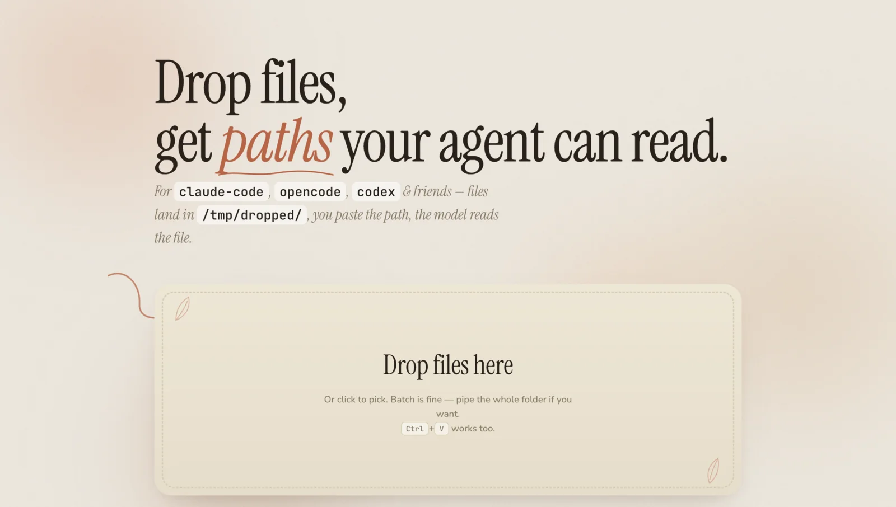
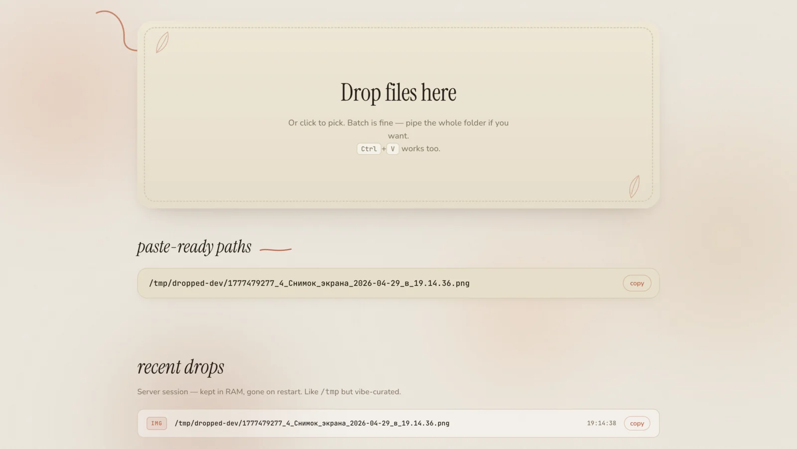

# frinklip

Local file drop server. Drag files into the browser, get absolute paths, paste into your CLI agent.



## What it solves

CLI agents like `claude-code`, `opencode`, `codex` can read files by path. But getting a file *to* the path is the painful part:

- You run the agent on a remote box or a VM and connect over SSH. Drag-n-drop into the terminal does nothing.
- You want to give the agent a screenshot, a PDF, a logo, 10 product images. `scp` for each one, then `ls` to get the path, then paste — that's the loop.
- You're on a laptop, the agent is on the server. The files are on the laptop.

frinklip runs on the same box as the agent. Drop files in the browser from any device on the LAN. They land in `/tmp/dropped/`. The page hands you the absolute path. Paste it into the agent. Agent reads the file.

Works for anything the agent's tools can read: images for vision, PDFs for parsing, video/gif assets for a project, code dumps, screenshots.



## Install

```bash
curl -fsSL https://raw.githubusercontent.com/eduard256/frinklip/main/install.sh | sudo bash
```

Open `http://<lan-ip>:3467` from any device on the network.

## Manual install

Don't want to pipe a script into shell? See [INSTALL.md](INSTALL.md).

## License

MIT
